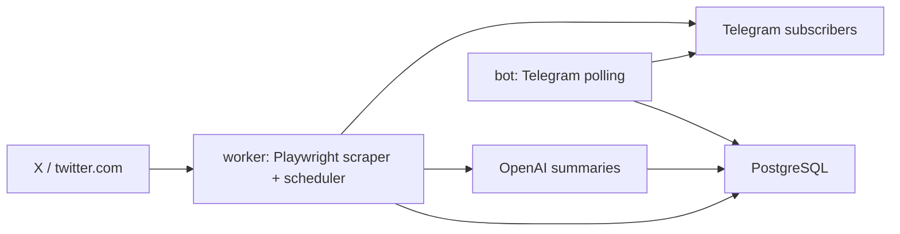

# Daily X Digest Bot

Telegram bot that watches one X account, summarizes the day's posts with OpenAI,
and pushes a daily digest to approved subscribers at NZ 20:00.

## Architecture



Runtime is split into two long-running processes:

- `src.main`: Telegram bot polling and admin/user commands.
- `src.worker`: APScheduler jobs for scraping, pre-generating the digest, and daily push.

On Windows, if antivirus removes Playwright's bundled Chromium, set
`PLAYWRIGHT_BROWSER_CHANNEL=chrome` in `.env` to use the installed system
Chrome. Leave it empty in Linux Docker production.

## Local Development

1. Copy `.env.example` to `.env` and fill the real values.
2. Start Postgres:

```powershell
docker compose up -d
```

3. Apply migrations:

```powershell
uv run alembic upgrade head
```

4. Start the bot and worker in two terminals:

```powershell
uv run python -m src.main
uv run python -m src.worker
```

Useful admin commands:

- `/test_digest`: generate today's digest and send it only to the admin.
- `/test_push`: reuse or generate today's digest and send it only to the admin.
- `/broadcast <message>`: send an admin announcement to all enabled subscribers.
- `/cost [days]`: show OpenAI usage cost for recent days.

## Production Deployment

Production is deployed by GitHub Actions. Do not edit application code directly
on the server as the normal release path.

Repository variables:

- `EC2_HOST`
- `EC2_USER`
- `DEPLOY_DIR`

Repository secrets:

- `EC2_SSH_PRIVATE_KEY`
- `TELEGRAM_BOT_TOKEN`
- `ADMIN_USER_ID`
- `OPENAI_API_KEY`
- `X_SCRAPER_USERNAME`
- `X_SCRAPER_COOKIES`
- `POSTGRES_PASSWORD`

The workflow runs CI on `pull_request` and `push` to `main`. Production deploy is
manual through `workflow_dispatch` with `deploy_to_ec2=true`.

On EC2 the release layout is:

```text
/home/ubuntu/apps/daily-x-digest-bot/
  current -> releases/<commit-sha>
  releases/<commit-sha>/
  shared/.env
```

Docker Compose runs four services:

- `postgres`: internal PostgreSQL 16 database.
- `migrate`: one-shot `alembic upgrade head`.
- `bot`: Telegram polling process.
- `worker`: scheduler process.

## Verification

After deployment:

1. Check the GitHub Actions run is green.
2. On EC2, verify containers are healthy:

```bash
cd /home/ubuntu/apps/daily-x-digest-bot/current
docker compose --env-file .env -f deploy/docker-compose.prod.yml ps
```

3. Send `/test_push` to the Telegram bot as admin.
4. Confirm `/cost 1` responds and does not show unexpected spend.

## Known Risks

- X scraping can fail because of account, cookies, or IP risk control. Refresh
  `X_SCRAPER_COOKIES` first; move to a residential IP fallback if EC2 is blocked.
- `PLAYWRIGHT_BROWSER_CHANNEL` should stay empty in Docker production. It is only
  for local Windows fallback to system Chrome or Edge.
- Telegram users who block the bot will fail pushes. After three consecutive
  failures the subscriber is disabled automatically.
- OpenAI model prices can change. The current cost accounting uses the price
  constants in `src/ai/client.py`.
